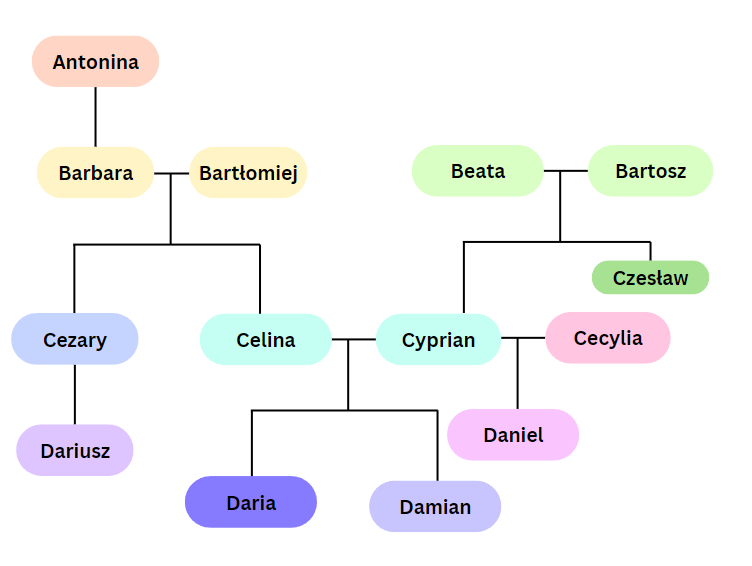

# Zadanie 2

```prolog
osoba(antonina).
osoba(barbara).
osoba(bartlomiej).
osoba(beata).
osoba(bartosz).
osoba(cezary).
osoba(celina).
osoba(cyprian).
osoba(czeslaw).
osoba(cecylia).
osoba(dariusz).
osoba(daria).
osoba(damian).
osoba(daniel).

mezczyzna(bartlomiej).
mezczyzna(bartosz).
mezczyzna(cezary).
mezczyzna(cyprian).
mezczyzna(czeslaw).
mezczyzna(dariusz).
mezczyzna(damian).
mezczyzna(daniel).

%rodzic(x,y) x jest rodzicem y
rodzic(antonina,barbara).
rodzic(barbara,cezary).
rodzic(bartlomiej,cezary).
rodzic(barbara,celina).
rodzic(bartlomiej,celina).
rodzic(beata,cyprian).
rodzic(bartosz,cyprian).
rodzic(beata,czeslaw).
rodzic(bartosz,czeslaw).
rodzic(cezary,dariusz).
rodzic(celina,daria).
rodzic(cyprian,daria).
rodzic(celina,damian).
rodzic(cyprian,damian).
rodzic(cyprian,daniel).
rodzic(cecylia,daniel).

kobieta(X) :-
	\+mezczyzna(X).

kobieta(antonina).
kobieta(barbara).
kobieta(beata).
kobieta(celina).
kobieta(cecylia).
kobieta(daria).

%X jest ojecem Y
ojciec(X,Y) :- 
	mezczyzna(X),
	rodzic(X,Y).

%X jest matka y
matka(X,Y) :-
	 kobieta(X),
	rodzic(X,Y).

%X jest corka Y
corka(X,Y) :-
	kobieta(X), 
	rodzic(Y,X).

%X jest rodzony bratem Y 
brat_rodzony(X,Y) :-
  mezczyzna(X),
    
         
   	matka(M,X),
    matka(M,Y),
         
   	ojciec(O,X),
  	ojciec(O,Y),
        
 
  	M\=O,
   X\=Y.

%X jest przyrodnim bratem Y
brat_przyrodni(X, Y) :-
    mezczyzna(X),
    (
      rodzic(R,X),
      rodzic(R,Y),
      rodzic(RP,X),
      \+rodzic(RP,Y),
      R\=RP
    ),
   X\=Y.

%x jest kuzynen y
kuzyn(X,Y) :-
	mezczyzna(X),
	rodzic(M,X),
	rodzic(C,Y),
	rodzic(B,M),
	rodzic(B,C),
	M\=B,
	M\=C,
	C\=B.

%x dziadek od strony ojca dla y 
dziadek_od_strony_ojca(X,Y) :-
	mezczyzna(X),
	ojciec(X,O),
	ojciec(O,Y).

%x dziadek od strony matki dla y
dziadek_od_strony_matki(X,Y) :-
	mezczyzna(X),
	ojciec(X,M),
	matka(M,Y).

%x dziadek y
dziadek(X,Y) :-
	mezczyzna(X),
	ojciec(X,R),
	rodzic(R,Y).

%x babcia y 
babcia(X,Y) :-
	kobieta(X),
	matka(X,R),
	rodzic(R,Y).

%y jest wnuczka x
wnuczka(X,Y) :-
	kobieta(Y),
	rodzic(X,R),
	rodzic(R,Y).

%x jest przodkiem 2 pokolenia y
przodek_do_2pokolenia_wstecz(X,Y) :-
	babcia(X,Y);
	dziadek(X,Y).

%BD - babcia lub dziadek
%x jest przodkiem 3 pokolenia y
przodek_do_3pokolenia_wstecz(X,Y) :-

	rodzic(X,BD),
	(
		babcia(BD,Y);
		dziadek(BD,Y)
	).

```

